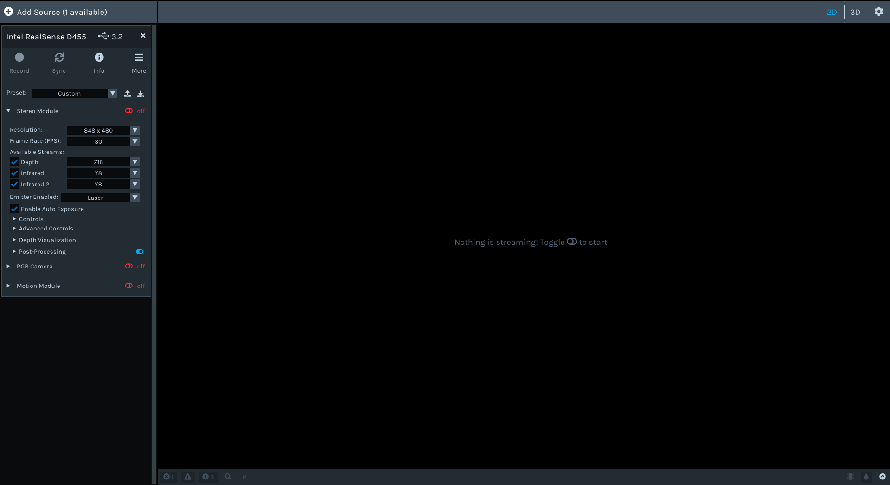
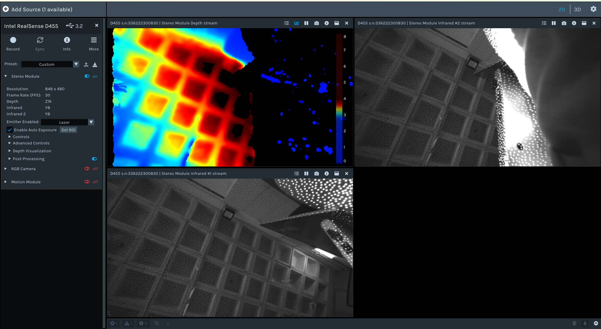

# VSLAM-in-Jetson-Orin
Steps to run NVIDIA's VSLAM in Jetson Orin nano using the Docker method.

This doc gives step by step instructions to setup Issac ROS and run the VSLAM using the Realsense D455 camera.

## 1. Prereq
Yon need the following things to begin with
* A Jetson Orin Nano with atleast 8 GB memory and SSD
* A Realsense D455 Camera
* ***[VERY IMPORTANT]*** A ***USB 3.2*** capable cable (3.2 gen1, gen2, or gen2x2).
    >Since all the USB ports of Jetson Orin Nano are USB 3.2 capable, both A to C and C to C cables will work fine.
* A fast and reliable internet connection
* Some Luck : )

## 2. Setting up the Docker and Env
So the Environment and dependency setup will in two phases, 
* Compute Setup
* Sensor Setup

### 2.1 Compute Setup
Here we are assuming that you have installed Jetpack on the SSD itself, so this will help us in keeping things cleaner and avoiding unnecessary sudo commands. </br>
Although there are methods in which the Jetpack is installed on a SD card and the ssd is used as a secondary storage just for Docker related files, the [official documentation](https://nvidia-isaac-ros.github.io/getting_started/dev_env_setup.html) assumes this.

The approach we are going to follow is adapted from [StereoLabs Tutorial](https://www.stereolabs.com/docs/isaac-ros/setting_up_isaac_ros)

> You may put the Orin in Super mode by setting the Power mode to ***MAXN SUPER***. 

Let's begin....

1. Add *user* to Docker group:
    ```shell
    sudo usermod -aG docker $USER
    newgrp docker
    ```

2. Setup Docker:
    ```shell
    # Add Docker's official GPG key:
    sudo apt-get update
    sudo apt-get install ca-certificates curl gnupg
    sudo install -m 0755 -d /etc/apt/keyrings
    curl -fsSL https://download.docker.com/linux/ubuntu/gpg | sudo gpg --dearmor -o /etc/apt/keyrings/docker.gpg
    sudo chmod a+r /etc/apt/keyrings/docker.gpg

    # Add the repository to Apt sources:
    echo \
    "deb [arch="$(dpkg --print-architecture)" signed-by=/etc/apt/keyrings/docker.gpg] https://download.docker.com/linux/ubuntu \
    "$(. /etc/os-release && echo "$VERSION_CODENAME")" stable" | \
    sudo tee /etc/apt/sources.list.d/docker.list > /dev/null
    sudo apt-get update

    sudo apt install docker-buildx-plugin
    ```
3. Restart Docker:
    ```shell
    sudo systemctl daemon-reload && sudo systemctl restart docker
    ```

4. Install [Git LFS](https://git-lfs.com/) to pull down all large files:
    ```shell
    sudo apt-get install git-lfs
    git lfs install --skip-repo
    ```
5. Some prereq:
    ```shell
        sudo apt-get update
        sudo apt-get install python3 python3-pip # Install python3
        sudo apt-get install nvidia-jetpack # Install the Jetson developer tools
        sudo pip3 install jetson-stats # Optional but recommended to monitor the status of the Jetson™ module
    ```
6. Jetson Setup for VPI:</br>
    Adapted from [here](https://nvidia-isaac-ros.github.io/getting_started/hardware_setup/compute/jetson_vpi.html)
    ```shell
    sudo nvidia-ctk cdi generate --mode=csv --output=/etc/cdi/nvidia.yaml
    ```
    Then install pva-allow-2 package:
    ```shell
    # Add Jetson public APT repository
    sudo apt-get update
    sudo apt-get install software-properties-common
    sudo apt-key adv --fetch-key https://repo.download.nvidia.com/jetson/jetson-ota-public.asc
    sudo add-apt-repository 'deb https://repo.download.nvidia.com/jetson/common r36.4 main'
    sudo apt-get update
    sudo apt-get install -y pva-allow-2
    ```

7. Create a workspace and add it to the environment:<br>
Here we do the divergence, the [Official docs](https://nvidia-isaac-ros.github.io/getting_started/dev_env_setup.html#:~:text=Create%20a%20ROS%202%20workspace%20for%20experimenting%20with%20Isaac%20ROS%3A) places the workspace in the `/mnt` dir, this is done because it assumes that the Jetpack is installed in SD Card, but we are assuming that the Jetpack also resides on the SSD.
    ```shell
    mkdir -p ~/ros2/isaac_ros_ws/src
    echo "export ISAAC_ROS_WS=${HOME}/ros2/isaac_ros_ws/" >> ~/.bashrc
    source ~/.bashrc
    ```
    >The base path can be anywhere,  but choose somewhere within the home directory, we tested with `~/Documents/issac_ros_ws/src` and it worked.

8. Enter the workspace and clone packages: 
    ```shell
    cd ${ISAAC_ROS_WS}/src
    git clone https://github.com/NVIDIA-ISAAC-ROS/isaac_ros_common.git --branch release-3.2 --recurse-submodules
    ```

9. Pull the official Isaac Common Docker image and start the first instance of development environment:
    ```shell
    cd ${ISAAC_ROS_WS}/src/isaac_ros_common && ./scripts/run_dev.sh
    ```
    This may take 10-20 mins depending upon your internet speed.

    >When the build is complete, the Docker container will start automatically. You can verify that you are inside the Docker container by checking the command prompt, which should look like `admin@ubuntu:/workspaces/isaac_ros-dev$`

### 2.2 Sensor Setup
Here we install the necessary SDKs and drivers for the Realsense D455. This section  follows exactly the [Isaac ROS RealSense Setup](https://nvidia-isaac-ros.github.io/getting_started/hardware_setup/sensors/realsense_setup.html).

1. Here firstly we make sure to upgrade/downgrade the firmware of the camera to [version 5.13.0.50](https://dev.realsenseai.com/docs/firmware-releases-d400). This can be done using the `rs-fw-update` tool which ships with [*librealsense SDKs*](https://github.com/IntelRealSense/librealsense). Firmware can also be augmented usign the an `.exe` on Windows([see here](https://dev.realsenseai.com/docs/firmware-update-tool#:~:text=For%20Windows%2010,install%20the%20SDK)).

Next the *librealsense* SDK and *realsense-ros driver* will be added to the docker image via the following steps:

2. Connect the Realsense RealSense Device.
3. Configure the container created by `isaac_ros_common/scripts/run_dev.sh`: 
    ```shell
    cd ${ISAAC_ROS_WS}/src/isaac_ros_common/scripts && \
    touch .isaac_ros_common-config && \
    echo CONFIG_IMAGE_KEY=ros2_humble.realsense > .isaac_ros_common-config
    ```
4. Launch the Docker container:
    ```shell
    cd ${ISAAC_ROS_WS}/src/isaac_ros_common && \
    ./scripts/run_dev.sh -d ${ISAAC_ROS_WS}
    ```
    >This step rebuilds the Docker images with the new layers. Will  take around an hour, so sitback and relax.
5. After the container image is rebuilt and you are inside the container, you can run `realsense-viewer` to verify that the RealSense camera is connected.
>To verify if everything is working perfectly, do the following <br> 
>* Toggle off the `Stereo Module`, check both `infrared` and `infreared 2`, switch to  `2D` mode.
>* Finally, turn on the `Stereo Module`, you should be able to see both the infrared streams with the depth stream, this means things went well.


Now we are done with the setup, and can now proceed with VSLAM......

## 3. VSLAM 
This section too follows the [quickstart guide](https://nvidia-isaac-ros.github.io/repositories_and_packages/isaac_ros_visual_slam/isaac_ros_visual_slam/index.html) and the [Tutorial with Realsense](https://nvidia-isaac-ros.github.io/concepts/visual_slam/cuvslam/tutorial_realsense.html)

1. Download Quickstart Assets(TBD outside the docker container):
    ```shell
    sudo apt-get install -y curl jq tar
    ```
    Then run these commands to download the asset from NGC:
    > Preferably put these into a shell file (`.sh`) and then execute the shell file (make sure to make it executable first by setting proper permissions)
    ```shell
    NGC_ORG="nvidia"
    NGC_TEAM="isaac"
    PACKAGE_NAME="isaac_ros_visual_slam"
    NGC_RESOURCE="isaac_ros_visual_slam_assets"
    NGC_FILENAME="quickstart.tar.gz"
    MAJOR_VERSION=3
    MINOR_VERSION=2
    VERSION_REQ_URL="https://catalog.ngc.nvidia.com/api/resources/versions?orgName=$NGC_ORG&teamName=$NGC_TEAM&name=$NGC_RESOURCE&isPublic=true&pageNumber=0&pageSize=100&sortOrder=CREATED_DATE_DESC"
    AVAILABLE_VERSIONS=$(curl -s \
        -H "Accept: application/json" "$VERSION_REQ_URL")
    LATEST_VERSION_ID=$(echo $AVAILABLE_VERSIONS | jq -r "
        .recipeVersions[]
        | .versionId as \$v
        | \$v | select(test(\"^\\\\d+\\\\.\\\\d+\\\\.\\\\d+$\"))
        | split(\".\") | {major: .[0]|tonumber, minor: .[1]|tonumber, patch: .[2]|tonumber}
        | select(.major == $MAJOR_VERSION and .minor <= $MINOR_VERSION)
        | \$v
        " | sort -V | tail -n 1
    )
    if [ -z "$LATEST_VERSION_ID" ]; then
        echo "No corresponding version found for Isaac ROS $MAJOR_VERSION.$MINOR_VERSION"
        echo "Found versions:"
        echo $AVAILABLE_VERSIONS | jq -r '.recipeVersions[].versionId'
    else
        mkdir -p ${ISAAC_ROS_WS}/isaac_ros_assets && \
        FILE_REQ_URL="https://api.ngc.nvidia.com/v2/resources/$NGC_ORG/$NGC_TEAM/$NGC_RESOURCE/\
    versions/$LATEST_VERSION_ID/files/$NGC_FILENAME" && \
        curl -LO --request GET "${FILE_REQ_URL}" && \
        tar -xf ${NGC_FILENAME} -C ${ISAAC_ROS_WS}/isaac_ros_assets && \
        rm ${NGC_FILENAME}
    fi
    ```

2. Clone this repository under ${ISAAC_ROS_WS}/src:
    ```shell
    cd ${ISAAC_ROS_WS}/src && \
    git clone -b release-3.2 https://github.com/NVIDIA-ISAAC-ROS/isaac_ros_visual_slam.git isaac_ros_visual_slam
    ```
3. Launch the Docker container using the run_dev.sh script:
    ```shell
    cd ${ISAAC_ROS_WS}/src/isaac_ros_common && \
    ./scripts/run_dev.sh
    ```
4. Use rosdep to install the package’s dependencies:
    ```shell
    sudo apt-get update
    rosdep update && rosdep install --from-paths ${ISAAC_ROS_WS}/src/isaac_ros_visual_slam/isaac_ros_visual_slam --ignore-src -y
    ```
5. Build the package from source:
    ```shell
    cd ${ISAAC_ROS_WS}/ && \
    colcon build --symlink-install --packages-up-to isaac_ros_visual_slam --base-paths ${ISAAC_ROS_WS}/src/isaac_ros_visual_slam/isaac_ros_visual_slam
    ```

6. Source the ROS workspace:

    >Note<br>
    Make sure to repeat this step in every terminal created inside the Docker container.<br>
    Because this package was built from source, the enclosing workspace must be sourced for ROS to be able to find the package’s contents.
    ```shell
    source install/setup.bash
    ```
Follow the subsequent steps as mentioned in the [quickstart guide](https://nvidia-isaac-ros.github.io/repositories_and_packages/isaac_ros_visual_slam/isaac_ros_visual_slam/index.html) or the [Tutorial with Realsense](https://nvidia-isaac-ros.github.io/concepts/visual_slam/cuvslam/tutorial_realsense.html).

>One thing you might need to change is the camera's `depth_module.profile` parameter [here](https://github.com/NVIDIA-ISAAC-ROS/isaac_ros_visual_slam/blob/19be8c781a55dee9cfbe9f097adca3986638feb1/isaac_ros_visual_slam/launch/isaac_ros_visual_slam_realsense.launch.py#L36C12-L36C50).<br>
If it's set like `'depth_module.profile': '640x360x90'`, then change the 360 to 480, i.e `'depth_module.profile': '640x480x90'`. This is because the camera sometimes reports the orginal configuration as invalid.
